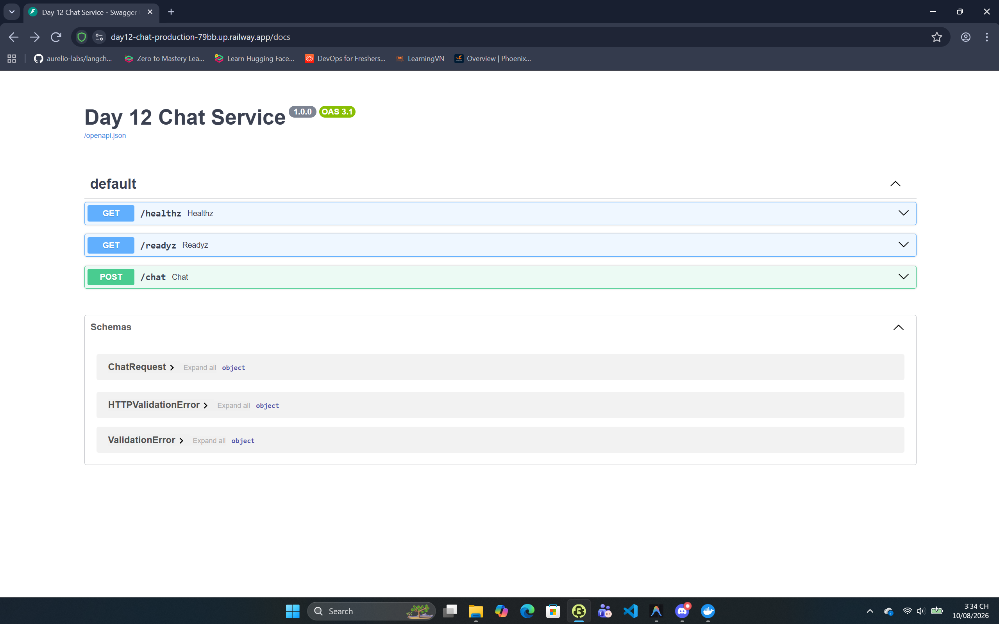

# Thông Tin Deploy — Checkpoint 5

> **Chỉ ghi TÊN biến môi trường, tuyệt đối không dán giá trị token vào đây.**
> Repo này công khai — dán token vào là mất token.

## Thông Tin Học Viên

| Mục | Nội dung |
|-----|----------|
| Họ và tên | Như Văn Hùng |
| Mã học viên | 2A202601372 |
| Repo | https://github.com/nuroqzavitex/K4-DAY12-2A202601372-NhuVanHung |

## Service

| Mục | Nội dung |
|-----|----------|
| Public URL | https://day12-chat-production-79bb.up.railway.app/ |
| Platform | Railway |
| Ngày deploy | 2026-08-10 |

## Biến Môi Trường Đã Set Trên Cloud

Ghi tên biến và **nguồn giá trị**, không ghi giá trị:

| Biến | Đã set | Ghi chú |
|------|--------|---------|
| `PORT` | ✅ | platform tự gán |
| `API_TOKEN` | ✅ | đặt trong dashboard, không nằm trong repo |
| `REDIS_URL` | ✅ | Redis add-on của Railway (${{day12-chat-redis.REDIS_URL}}) |
| `BUCKET_CAPACITY` | ✅ | 10 |
| `REFILL_PER_MINUTE` | ✅ | 10 |
| `DAILY_BUDGET_USD` | ✅ | 1.0 |
| `LOG_LEVEL` | ✅ | INFO |

## Lệnh Kiểm Tra

Thay `<URL>` bằng Public URL ở trên:

```bash
# 1. Liveness — mong đợi 200 {"status":"ok"}
curl -i https://day12-chat-production-79bb.up.railway.app/healthz

# 2. Readiness — mong đợi 200 {"status":"ready"} (đã nối được Redis)
curl -i https://day12-chat-production-79bb.up.railway.app/readyz

# 3. Không có token — mong đợi 401 kèm header WWW-Authenticate
curl -i -X POST https://day12-chat-production-79bb.up.railway.app/chat \
  -H "Content-Type: application/json" \
  -d '{"message":"Hello"}'

# 4. Có token — mong đợi 200 kèm câu trả lời
curl -i -X POST https://day12-chat-production-79bb.up.railway.app/chat \
  -H "Content-Type: application/json" \
  -H "Authorization: Bearer $API_TOKEN" \
  -H "X-Client-Id: sv-test" \
  -d '{"message":"Deploy là gì?"}'

# 5. Rate limit — gọi 15 lần, những lần cuối phải trả 429
for i in $(seq 1 15); do
  curl -s -o /dev/null -w "%{http_code} " -X POST https://day12-chat-production-79bb.up.railway.app/chat \
    -H "Content-Type: application/json" \
    -H "Authorization: Bearer $API_TOKEN" \
    -H "X-Client-Id: sv-test" \
    -d '{"message":"test"}'
done; echo
```

## Kết Quả Chạy Thật

```text
HTTP/1.1 200 OK
content-type: application/json
{"status":"ok","service":"day12-chat-service","version":"1.0.0"}

HTTP/1.1 200 OK
content-type: application/json
{"status":"ready","redis":true}

HTTP/1.1 401 Unauthorized
www-authenticate: Bearer
{"detail":"invalid or missing bearer token"}

HTTP/1.1 200 OK
content-type: application/json
{"reply":"[Mock LLM] Bạn vừa hỏi: Deploy là gì?","client_id":"sv-test","turns_before":0,"usd_cost":0.00015,"usage":{"prompt":15,"completion":30}}

200 200 200 200 200 200 200 200 200 200 429 429 429 429 429
```

## Ảnh Chụp Màn Hình

Đã lưu ảnh trong thư mục `screenshots/`:

- `screenshots/day12-chat-service.png` — Trang quản lý service trên Railway dashboard và kết quả gọi API



